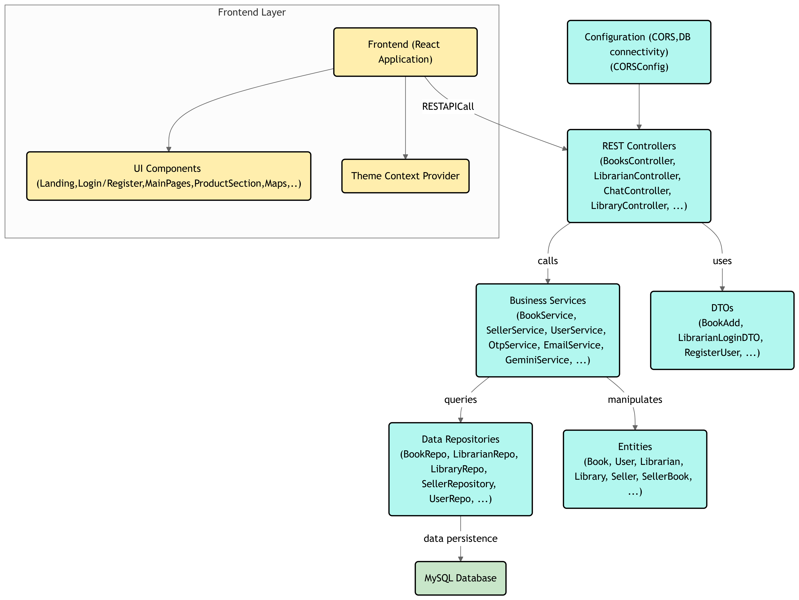

# 📚 Bookie - The Ultimate Book Selling Platform

🚀 **From Digital Library to Bookie!**

Bookie is a next-gen platform that bridges the gap between book sellers and readers. Originally conceptualized as a **Digital Library**, Bookie has evolved into a dynamic marketplace where sellers can list books, manage stock, and set prices, while users can explore, purchase, and connect with sellers directly.

---

## ✨ Features

### 🔹 For Book Sellers
- ✅ List books with details (name, author, price, stock availability)
- ✅ Manage inventory seamlessly

### 🔹 For Users
- ✅ Browse books and view detailed descriptions
- ✅ Purchase books through multiple payment options
- ✅ Contact sellers directly via email for inquiries
- ✅ **AI-Powered Chatbot** – Personalized book recommendations based on interests, topics & subjects
- ✅ **Map Integration Completed** – Locate nearby sellers & purchase books directly

### 🚀 Upcoming Features
- 🔜 **Payment Gateway Integration** – Secure & seamless transactions

---

## 🛠 Tech Stack

| Component  | Technology |
|------------|------------|
| **Frontend**  | React (Vite) |
| **Backend**  | Spring Boot |
| **Database**  | MySQL |
| **Initial Version**  | HTML, CSS, JavaScript, Thymeleaf, Spring MVC |
| **Upgraded Version**  | React + Vite, Spring Boot, Expanded Database (3 new tables) |

---

## 🚀 Getting Started

### 🔧 Prerequisites
- Java JDK 17+
- Maven 3.6+
- Node.js & npm (for frontend)
- MySQL Database

### 💻 Installation

#### 🔹 Backend (Spring Boot)
```bash
# Clone the repository
git clone https://github.com/PralayeshMukherjee/MyLibrary.git
cd MyLibrary

# Navigate to backend folder
cd backend

# Install dependencies & build
mvn clean install

# Configure Database in `application.properties`
spring.datasource.url=jdbc:mysql://localhost:3306/bookie
spring.datasource.username=root
spring.datasource.password=your_password

# Run the backend server
mvn spring-boot:run
```

#### 🔹 Frontend (React + Vite)
```bash
# Navigate to frontend folder
cd frontend

# Install dependencies
npm install

# Start development server
npm run dev
```

📌 The frontend runs on `http://localhost:5173` and backend on `http://localhost:8080`.

---

## 🏆 Contributing

Contributions are welcome! 🎉 Feel free to fork the repository, create a new branch, and submit a pull request.

1. Fork the project
2. Create a feature branch (`git checkout -b feature-newFeature`)
3. Commit changes (`git commit -m 'Added a new feature'`)
4. Push to branch (`git push origin feature-newFeature`)
5. Open a pull request

---

## 📝 License
This project is licensed under the MIT License. See the [LICENSE](LICENSE) file for details.

---

## 📩 Contact
🔗 **GitHub**: [PralayeshMukherjee](https://github.com/PralayeshMukherjee)  
🔗 **LinkedIn**: [Connect with me](https://www.linkedin.com/in/pralayesh-mukherjee-756a8b276/)  
💡 Have suggestions? Let's innovate together! 🚀📚

---

## 🌍 Architecture Diagram


